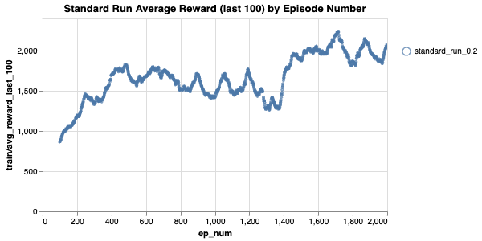
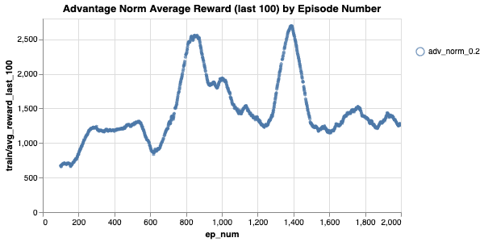
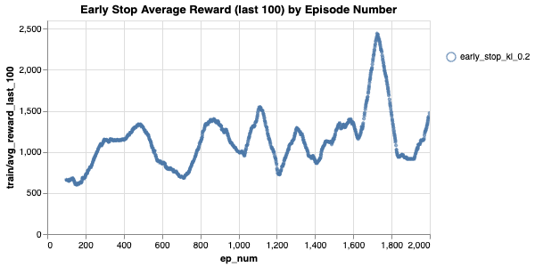
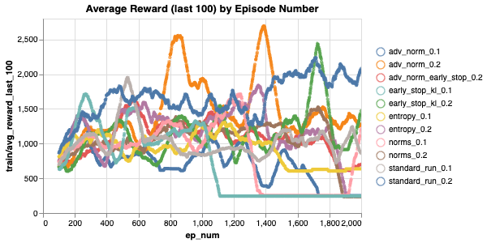

# PPO to Beat Mario

## Link

WandB: https://wandb.ai/arth-shukla/Mario-PPO

## Resources Used

I expanded on my PPO model from my CartPole project: https://github.com/arth-shukla/ppo-gym-cartpole.

I based the image processing based on the original Atari Game DQN paper here: https://storage.googleapis.com/deepmind-media/dqn/DQNNaturePaper.pdf which I implemented for a DDQN model here: https://github.com/arth-shukla/ddqn-mario.

## Technologies Used

Algorithms/Concepts: PPO

AI Development: Pytorch (Torch, Cuda)

## Evaluation and Inference

I trained the model using many different performance improvement techniques, including

1. early stop based on approx kl
2. advantage normalization
3. entropy regularization
4. GAE
5. normal DL techniques like grad normalization and lr scheduling

The most successful were the following three:

1. Simple, standard PPO run
2. PPO with early stopping using approx KL divergence
3. PPO with advantage norming

Each run was capped at 2000 episodes, which is 6.5x fewer iterations than my [DDQN required](https://github.com/arth-shukla/ddqn-mario) to acheive similar results!

<table cellspacing="0" cellpadding="0">
  <tr>
    <td></td>
    <td></td>
  </tr>
  <tr>
    <td></td>
    <td></td>
  </tr>
</table>

Note that the PPO does still sometimes fail, but in general it performs well. Here are some successful trials using the pretrained checkpoints available in this repo:

<table>
  <thead>
    <th>Standard PPO</th>
    <th>PPO Advantage Normalization</th>
    <th>PPO Early Stop (Approx KL Div)</th>
  </thead>
  <tbody>
    <tr>
      <td></td>
      <td></td>
      <td></td>
    </tr>
  </tbody>
</table>

## Future Experiments

I will run this with a PPO algo I wrote earlier for Cartpole (https://github.com/arth-shukla/ppo-gym-cartpole) altered to include the same convolutions. PPO should not only be able to run cartpole well, but it should be able to learn multiple levels or The Lost Levels (a version of Mario 2 not released in the west due to its difficulty), all of which is included in the Mario Gym API.

## About Me

Arth Shukla [Site](https://arth.website) | [GitHub](https://github.com/arth-shukla) | [LinkedIn](https://www.linkedin.com/in/arth-shukla/)
