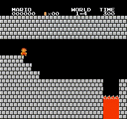
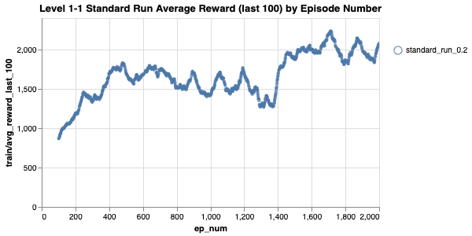
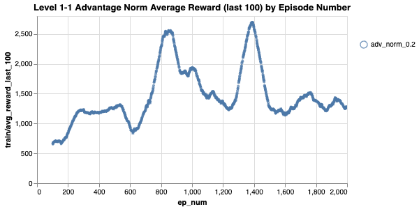
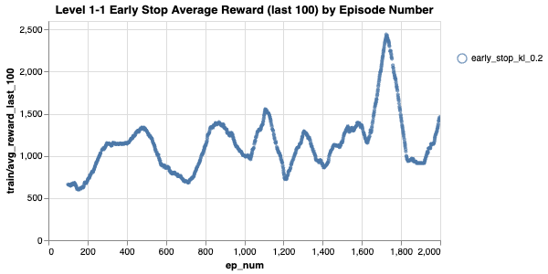
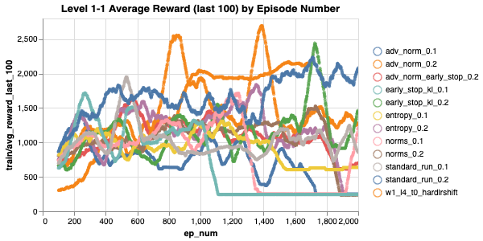
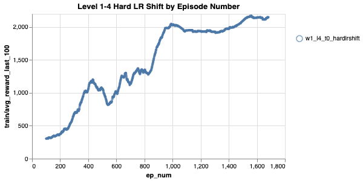

# PPO to Beat Mario

## Link

WandB: https://wandb.ai/arth-shukla/Mario-PPO

## Resources Used

I expanded on my PPO model from my CartPole project: https://github.com/arth-shukla/ppo-gym-cartpole.

I based the image processing based on the original Atari Game DQN paper here: https://storage.googleapis.com/deepmind-media/dqn/DQNNaturePaper.pdf which I implemented for a DDQN model here: https://github.com/arth-shukla/ddqn-mario.

## Technologies Used

Algorithms/Concepts: PPO

AI Development: Pytorch (Torch, Cuda)

## Evaluation and Inference

I trained the model using many different performance improvement techniques, including

1. early stop based on approx kl
2. advantage normalization
3. entropy regularization
4. GAE
5. normal DL techniques like grad normalization and lr scheduling

I tested on two levels, 1-1 and 1-4, each with different goals. For my 1-1 tests, I wanted to see what impact different tricks had, while for 1-4 I wanted to stabilize the policy after reaching high average reward.

<table>
  <thead>
    <th>1-4 Hard LR Shift</th>
    <th>1-1 Standard PPO</th>
    <th>1-1 PPO Advantage Normalization</th>
    <th>1-1 PPO Early Stop (Approx KL Div)</th>
  </thead>
  <tbody>
    <tr>
      <td></td>
      <td></td>
      <td></td>
      <td></td>
    </tr>
  </tbody>
</table>

### Test 1: Level 1-1: Different Tricks

First, I wanted to see which tricks were most/least helpful for world 1-1, a very simple level. The best results came from the following three:

1. Simple, standard PPO run
2. PPO with early stopping using approx KL divergence
3. PPO with advantage norming

Different combinations of different techniques might help (or harm) training performance as well. Image charts can be seen below for the three runs mentioned below, as well as all the other tests I ran. Interactive charts are available on WandB: https://wandb.ai/arth-shukla/Mario-PPO. Each run was capped at 2000 episodes, which is 6.5x fewer iterations than my [DDQN required](https://github.com/arth-shukla/ddqn-mario) to acheive similar results!

Note that `run_name_1.0` indicates a run with `policy_clip=1.0`, likewise for `run_name_2.0`.

<table cellspacing="0" cellpadding="0">
  <tr>
    <td></td>
    <td></td>
  </tr>
  <tr>
    <td></td>
    <td></td>
  </tr>
</table>

### Test 2: Level 1-4: Stabilize After Peak

Level 1-4 is much more difficult than 1-1 since it is a boss castle. While the standard run resulted in a more stable policy, using different tricks led to reaching a peak in average reward much faster.

However, after reaching a peak in average reward, the policies would often catastrophically forget whatever they had previously learned. To try mitigating this, I added params `shift_lr_when_avg_rew_is` and `shifted_lr`. The idea here is to chop the learning rate down after the policy reaches some desired average reward so updates to model paramteres are less extreme.

I ran this test on Level 1-4 with entropy regularization and gradient and advantage normalization. The policy remained stable and was able to "focus on" winning the level more frequently, and it only took one run with a little over 1600 episodes to reach an optimal policy.

**NOTE**:

1. The max reward for level 1-4 is about 2000, while the max reward for 1-1 is about 2500.
2. This agent is very likely highly overfit on this level! It will certainly not generalize well.

## Future Experiments

I want to test with more complicated control tasks like those in DM Control. I also wonder if I could make a PPO Agent which can play any particular Mario level well by training for longer on random levels.

## About Me

Arth Shukla [Site](https://arth.website) | [GitHub](https://github.com/arth-shukla) | [LinkedIn](https://www.linkedin.com/in/arth-shukla/)
